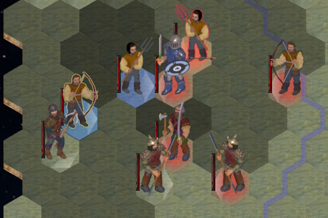

# hexes-of-battle

Take control of an army and battle a ~~challenging~~ challenged enemy in a turn based strategy game.

You can play the latest build of the game here: ➡️ <https://dezgusty.github.io/hexes-of-battle/> ⬅️

## Inspiration

Draws heavy inspiration from classics such as: Heroes of Might & Magic, Age of Wonders, some more modern TBS games, such Songs of Conquest and the Eador series, as as well as my own earlier attempt at such a game ([Megabattle 2002](https://github.com/dezGusty/megabattle2002))

## For developers

The game is developed using:

- [PixiJS](https://pixijs.com/)
- Typescript and Vite

How to run it locally (requires git & Node.js v.22 or newer):

- clone the repository
- open a terminal
- go to the project folder and run `npm install` to install the dependencies
- run `npm run dev` to run the server locally in development mode
- open the link provided by Vite in the terminal: (E.g. <http://localhost:5173/>)
- open a code editor (E.g. vscode) and start hacking at the code

## Licensing

The source code is available under the MIT license.
The graphics are created using a mix of own effort and graphics AI generation services (Nightcafe). They are also released under the terms of the MIT license.
Some UI art is based on an earlier skin for CEGUI.

All other resources should be marked accordingly either here, or with a text document in the repository.

- none so far
